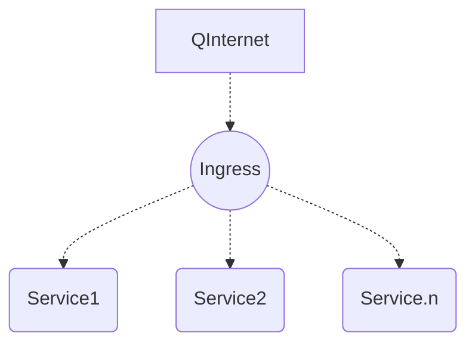

# Kubernetes网络之Ingress

Ingress 是对集群中服务的外部访问进行管理的 API 对象，典型的访问方式是 HTTP和HTTPS.

Ingress 可以提供负载均衡、SSL 和基于名称的虚拟托管.

必须具有 ingress 控制器[例如 ingress-nginx]才能满足 Ingress 的要求.仅创建 Ingress 资源无效.

本文通过Helm部署Nginx-Ingress.

## Ingress原理

Ingress 公开了从集群外部到集群内 services 的 HTTP 和 HTTPS 路由. 流量路由由 Ingress 资源上定义的规则控制.



可以将 Ingress 配置为提供服务外部可访问的 URL、负载均衡流量、 SSL / TLS，以及提供基于名称的虚拟主机.Ingress 控制器 通常负责通过负载均衡器来实现 Ingress，尽管它也可以配置边缘路由器或其他前端来帮助处理流量.

Ingress 不会公开任意端口或协议.若将 HTTP 和 HTTPS 以外的服务公开到 Internet 时，通常使用 Service.Type=NodePort 或者 Service.Type=LoadBalancer 类型的服务.

以Nginx Ingress为例，如图:


Nginx Ingress架构简易示意图


## 部署Helm 3.4

helm通过打包的方式，支持发布的版本管理和控制，很大程度上简化了Kubernetes应用的部署和管理.

Helm本质就是让k8s的应用管理（Deployment、Service等）可配置，能动态生成.通过动态生成K8S资源清单文件（deployment.yaml、service.yaml）.然后kubectl自动调用K8S资源部署.

> 说明: Helm3.x 版本已经不需要再安装tiller(之前老版本中的Helm仓库的服务端), 直接安装配置好仓库就可以使用了

```shell
# 在官方(https://github.com/helm/helm/releases)下载想要的的版本, 当前(2021-01-11)最新稳定版 V3.4.2
# 解压并配置
[root@k8s-master ~]# tar -zxvf helm-v3.4.2-linux-amd64.tar.gz
[root@k8s-master ~]# mv linux-amd64/helm /usr/local/bin/helm
[root@k8s-master ~]# helm version
version.BuildInfo{Version:"v3.4.2", GitCommit:"23dd3af5e19a02d4f4baa5b2f242645a1a3af629", GitTreeState:"clean", GoVersion:"go1.14.13"}
# 添加阿里仓库
[root@k8s-master ~]# helm repo add apphub https://apphub.aliyuncs.com
"apphub" has been added to your repositories
[root@k8s-master ~]# helm repo update
Hang tight while we grab the latest from your chart repositories...
...Successfully got an update from the "apphub" chart repository
Update Complete. ⎈Happy Helming!⎈
[root@k8s-master ~]# helm repo list
NAME    URL                        
apphub  https://apphub.aliyuncs.com
```

## Nginx-Ingress简单实例

```shell
# 切换到dev这个namespace下
[root@k8s-master ~]# kubens dev
Context "kubernetes-admin@kubernetes" modified.
Active namespace is "dev".
[root@k8s-master ~]# kubens -c
dev
[root@k8s-master ~]# kubectl get po
No resources found in dev namespace.
# 查找Ingress资源包
[root@k8s-master ~]# helm search repo apphub | grep ingress
apphub/aws-alb-ingress-controller       0.1.13          v1.1.5                          A Helm chart for AWS ALB Ingress Controller       
apphub/gce-ingress                      1.2.0           1.4.0                           A GCE Ingress Controller                          
apphub/haproxy-ingress                  0.0.22          0.7.2                           Ingress controller implementation for haproxy l...
apphub/ingressmonitorcontroller         1.0.48          1.0.47                          IngressMonitorController chart that runs on kub...
apphub/nginx-ingress                    1.30.3          0.28.0                          An nginx Ingress controller that uses ConfigMap...
apphub/nginx-ingress-controller         5.3.4           0.29.0                          Chart for the nginx Ingress controller            
[root@k8s-master kubernetes]# helm install nginx-ingress apphub/nginx-ingress-controller
NAME: nginx-ingress
LAST DEPLOYED: Mon Jan 11 13:50:42 2021
NAMESPACE: dev
STATUS: deployed
REVISION: 1
TEST SUITE: None
NOTES:
** Please be patient while the chart is being deployed **

The nginx-ingress controller has been installed.
It may take a few minutes for the LoadBalancer IP to be available.
You can watch the status by running 'kubectl --namespace dev get services -o wide -w nginx-ingress-nginx-ingress-controller'

An example Ingress that makes use of the controller:

  apiVersion: extensions/v1beta1
  kind: Ingress
  metadata:
    annotations:
      kubernetes.io/ingress.class: nginx
    name: example
    namespace: foo
  spec:
    rules:
      - host: www.example.com
        http:
          paths:
            - backend:
                serviceName: exampleService
                port: 80
              path: /
    # This section is only required if TLS is to be enabled for the Ingress
    tls:
        - hosts:
            - www.example.com
          secretName: example-tls

If TLS is enabled for the Ingress, a Secret containing the certificate and key must also be provided:

  apiVersion: v1
  kind: Secret
  metadata:
    name: example-tls
    namespace: foo
  data:
    tls.crt: <base64 encoded cert>
    tls.key: <base64 encoded key>
  type: kubernetes.io/tls
# 安装提示查看services
[root@k8s-master manifests]# kubectl --namespace dev get services -o wide -w nginx-ingress-nginx-ingress-controller
NAME                                     TYPE           CLUSTER-IP       EXTERNAL-IP     PORT(S)                      AGE   SELECTOR
nginx-ingress-nginx-ingress-controller   LoadBalancer   192.168.120.98   172.42.42.101   80:31051/TCP,443:30469/TCP   80m   app=nginx-ingress-controller,component=controller,release=nginx-ingress
# 以YAML形式查看配置
[root@k8s-master manifests]# kubectl get svc nginx-ingress-nginx-ingress-controller -o yaml
apiVersion: v1
kind: Service
metadata:
  annotations:
    meta.helm.sh/release-name: nginx-ingress
    meta.helm.sh/release-namespace: dev
  creationTimestamp: "2021-01-11T05:50:43Z"
  labels:
    app: nginx-ingress-controller
    app.kubernetes.io/managed-by: Helm
    chart: nginx-ingress-controller-5.3.4
    component: controller
    heritage: Helm
    release: nginx-ingress
  managedFields:
  - apiVersion: v1
    fieldsType: FieldsV1
    fieldsV1:
      f:metadata:
        f:annotations:
          .: {}
          f:meta.helm.sh/release-name: {}
          f:meta.helm.sh/release-namespace: {}
        f:labels:
          .: {}
          f:app: {}
          f:app.kubernetes.io/managed-by: {}
          f:chart: {}
          f:component: {}
          f:heritage: {}
          f:release: {}
      f:spec:
        f:externalTrafficPolicy: {}
        f:ports:
          .: {}
          k:{"port":80,"protocol":"TCP"}:
            .: {}
            f:name: {}
            f:port: {}
            f:protocol: {}
            f:targetPort: {}
          k:{"port":443,"protocol":"TCP"}:
            .: {}
            f:name: {}
            f:port: {}
            f:protocol: {}
            f:targetPort: {}
        f:selector:
          .: {}
          f:app: {}
          f:component: {}
          f:release: {}
        f:sessionAffinity: {}
        f:type: {}
    manager: Go-http-client
    operation: Update
    time: "2021-01-11T05:50:43Z"
  - apiVersion: v1
    fieldsType: FieldsV1
    fieldsV1:
      f:status:
        f:loadBalancer:
          f:ingress: {}
    manager: controller
    operation: Update
    time: "2021-01-11T06:19:47Z"
  name: nginx-ingress-nginx-ingress-controller
  namespace: dev
  resourceVersion: "755241"
  selfLink: /api/v1/namespaces/dev/services/nginx-ingress-nginx-ingress-controller
  uid: 279f27eb-0b77-4693-a0c5-4e77633acd86
spec:
  clusterIP: 192.168.120.98
  externalTrafficPolicy: Cluster
  ports:
  - name: http
    nodePort: 31051
    port: 80
    protocol: TCP
    targetPort: http
  - name: https
    nodePort: 30469
    port: 443
    protocol: TCP
    targetPort: https
  selector:
    app: nginx-ingress-controller
    component: controller
    release: nginx-ingress
  sessionAffinity: None
  type: LoadBalancer
status:
  loadBalancer:
    ingress:
    - ip: 172.42.42.101
[root@k8s-master manifests]# kubectl get po -o wide
NAME                                                              READY   STATUS    RESTARTS   AGE   IP             NODE        NOMINATED NODE   READINESS GATES
nginx-ingress-nginx-ingress-controller-667cb64f9c-zqg2q           1/1     Running   0          72m   172.16.36.72   k8s-node1   <none>           <none>
nginx-ingress-nginx-ingress-controller-default-backend-7ccrfv9m   1/1     Running   0          72m   172.16.36.83   k8s-node1   <none>           <none>
[root@k8s-master manifests]# kubectl get svc
NAME                                                     TYPE           CLUSTER-IP       EXTERNAL-IP     PORT(S)                      AGE
nginx-ingress-nginx-ingress-controller                   LoadBalancer   192.168.120.98   172.42.42.101   80:31051/TCP,443:30469/TCP   74m
nginx-ingress-nginx-ingress-controller-default-backend   ClusterIP      192.168.240.37   <none>          80/TCP                       74m
# LoadBalancer   192.168.120.98   172.42.42.101 
# ClusterIP      192.168.240.37
# PodIP          172.16.36.72
# NodeIP+Port    192.168.43.20:31051
# 上面这些均可访问Nginx服务
[root@k8s-master manifests]# curl 172.42.42.101
<!DOCTYPE html>
<html>
<head>
<title>Welcome to nginx!</title>
...
</body>
</html>
# 创建Ingress实例
[root@k8s-master ingress]# vi ngdemo.yaml 
apiVersion: apps/v1
kind: Deployment
metadata:
  name: my-nginx
spec:
  selector:
    matchLabels:
      app: my-nginx
  template:
    metadata:
      labels:
        app: my-nginx
    spec:
      containers:
      - name: my-nginx
        image: nginx
        ports:
        - containerPort: 80
---
apiVersion: v1
kind: Service
metadata:
  name: my-nginx
  labels:
    app: my-nginx
spec:
  ports:
  - port: 80
    protocol: TCP
    name: http
  selector:
    app: my-nginx
---
apiVersion: extensions/v1beta1
kind: Ingress
metadata:
  name: my-nginx
  annotations:
    kubernetes.io/ingress.class: nginx
spec:
  rules:
  - host: nginx.ingress.com  # 将域名映射到 my-nginx 服务
    http:
      paths:
      - path: /
        backend:
          serviceName: my-nginx  # 将所有请求发送到 my-nginx 服务的 80 端口
          servicePort: 80
[root@k8s-master ingress]# kubectl get svc
NAME                                                     TYPE           CLUSTER-IP       EXTERNAL-IP     PORT(S)                      AGE
my-nginx                                                 ClusterIP      192.168.177.62   <none>          80/TCP                       12m
nginx-ingress-nginx-ingress-controller                   LoadBalancer   192.168.120.98   172.42.42.101   80:31051/TCP,443:30469/TCP   96m
nginx-ingress-nginx-ingress-controller-default-backend   ClusterIP      192.168.240.37   <none>          80/TCP                       96m
# 将域名配置到hosts
[root@k8s-master ingress]# vi /etc/hosts
127.0.0.1   localhost localhost.localdomain localhost4 localhost4.localdomain4
::1         localhost localhost.localdomain localhost6 localhost6.localdomain6
192.168.43.10   k8s-master
192.168.43.20   k8s-node1
192.168.177.62  nginx.ingress.com
[root@k8s-master ingress]# curl http://nginx.ingress.com
<!DOCTYPE html>
<html>
<head>
<title>Welcome to nginx!</title>
...
</body>
</html>
```

下图显示了客户端是如果通过 Ingress Controller 连接到其中一个 Pod 的流程，客户端首先对 nginx.ingress.com 执行 DNS 解析，得到 Ingress Controller 所在节点的 IP，然后客户端向 Ingress Controller 发送 HTTP 请求，然后根据 Ingress 对象里面的描述匹配域名，找到对应的 Service 对象，并获取关联的 Endpoints 列表，将客户端的请求转发给其中一个 Pod.


## Nginx-Ingress综合实例

通过部署两套Service来实现: HTTP代理访问/HTTPS代理访问/BasicAuth认证/Rewrite重写验证, 并为之分配不同的域名进行区分.

### 创建deploy-svc1

```shell
[root@k8s-master ingress]# vi deploy-svc1.yaml
spec:
apiVersion: apps/v1
kind: Deployment
metadata:
  name: myapp-deploy1
  namespace: dev
spec:
  replicas: 2
  selector:
    matchLabels:
      app: myapp
      release: v1
  template:
    metadata:
      labels:
        app: myapp
        release: v1
        env: test
    spec:
      containers:
      - name: myapp
        image: registry.cn-beijing.aliyuncs.com/google_registry/myapp:v1
        imagePullPolicy: IfNotPresent
        ports:
        - name: http
          containerPort: 80
---
apiVersion: v1
kind: Service
metadata:
  name: myapp-svc1
  namespace: dev
spec:
  selector:
    app: myapp
    release: v1
  ports:
  - name: http
    port: 80
    targetPort: 80
[root@k8s-master ingress]# kubectl apply -f deploy-svc1.yaml 
deployment.apps/myapp-deploy1 created
service/myapp-svc1 created
[root@k8s-master ingress]# kubectl get deploy -o wide
NAME                                                     READY   UP-TO-DATE   AVAILABLE   AGE    CONTAINERS                                 IMAGES                                                           SELECTOR
myapp-deploy1                                            2/2     2            2           105s   myapp                                      registry.cn-beijing.aliyuncs.com/google_registry/myapp:v1        app=myapp,release=v1
...
[root@k8s-master ingress]# kubectl get rs -o wide
NAME                                                                DESIRED   CURRENT   READY   AGE     CONTAINERS                                 IMAGES                                                           SELECTOR
myapp-deploy1-6c468d6b6c                                            2         2         2       3m40s   myapp                                      registry.cn-beijing.aliyuncs.com/google_registry/myapp:v1        app=myapp,pod-template-hash=6c468d6b6c,release=v1
...
[root@k8s-master ingress]# kubectl get pod -o wide --show-labels
NAME                                                              READY   STATUS    RESTARTS   AGE     IP             NODE        NOMINATED NODE   READINESS GATES   LABELS
myapp-deploy1-6c468d6b6c-cq44z                                    1/1     Running   0          4m10s   172.16.36.86   k8s-node1   <none>           <none>            app=myapp,env=test,pod-template-hash=6c468d6b6c,release=v1
myapp-deploy1-6c468d6b6c-mzqwd                                    1/1     Running   0          4m10s   172.16.36.92   k8s-node1   <none>           <none>            app=myapp,env=test,pod-template-hash=6c468d6b6c,release=v1
# Curl访问
[root@k8s-master ingress]# curl 172.16.36.86
Hello MyApp | Version: v1 | <a href="hostname.html">Pod Name</a>
[root@k8s-master ingress]# curl 172.16.36.92
Hello MyApp | Version: v1 | <a href="hostname.html">Pod Name</a>
[root@k8s-master ingress]# curl 172.16.36.92/hostname.html
myapp-deploy1-6c468d6b6c-mzqwd
[root@k8s-master ingress]# curl 172.16.36.86/hostname.html
myapp-deploy1-6c468d6b6c-cq44z
# 查看SVC
[root@k8s-master ingress]# kubectl get svc 
NAME                                                     TYPE           CLUSTER-IP        EXTERNAL-IP     PORT(S)                      AGE
myapp-svc1                                               ClusterIP      192.168.226.120   <none>          80/TCP                       53s
...
# curl SVC, 可见Service后端两个Pod均可访问得到
[root@k8s-master ingress]# curl 192.168.226.120 
Hello MyApp | Version: v1 | <a href="hostname.html">Pod Name</a>
[root@k8s-master ingress]# curl 192.168.226.120/hostname.html
myapp-deploy1-6c468d6b6c-mzqwd
[root@k8s-master ingress]# curl 192.168.226.120/hostname.html
myapp-deploy1-6c468d6b6c-cq44z
```

### 创建deploy-svc2

```shell
[root@k8s-master ingress]# vi deploy-svc2.yaml 
apiVersion: apps/v1
kind: Deployment
metadata:
  name: myapp-deploy2
  namespace: dev
spec:
  replicas: 2
  selector:
    matchLabels:
      app: myapp
      release: v2
  template:
    metadata:
      labels:
        app: myapp
        release: v2
        env: test
    spec:
      containers:
      - name: myapp
        image: registry.cn-beijing.aliyuncs.com/google_registry/myapp:v2
        imagePullPolicy: IfNotPresent
        ports:
        - name: http
          containerPort: 80
---
apiVersion: v1
kind: Service
metadata:
  name: myapp-svc2
  namespace: dev
spec:
  selector:
    app: myapp
    release: v2
  ports:
  - name: http
    port: 80
    targetPort: 80
[root@k8s-master ingress]# kubectl apply -f deploy-svc2.yaml 
deployment.apps/myapp-deploy2 created
service/myapp-svc2 unchanged
[root@k8s-master ingress]# kubectl get deploy myapp-deploy2 -o wide
NAME            READY   UP-TO-DATE   AVAILABLE   AGE   CONTAINERS   IMAGES                                                      SELECTOR
myapp-deploy2   2/2     2            2           47s   myapp        registry.cn-beijing.aliyuncs.com/google_registry/myapp:v2   app=myapp,release=v2
[root@k8s-master ingress]# kubectl get rs -o wide
NAME                                                                DESIRED   CURRENT   READY   AGE    CONTAINERS                                 IMAGES                                                           SELECTOR
myapp-deploy1-6c468d6b6c                                            2         2         2       13m    myapp                                      registry.cn-beijing.aliyuncs.com/google_registry/myapp:v1        app=myapp,pod-template-hash=6c468d6b6c,release=v1
myapp-deploy2-5fffdcccd5                                            2         2         2       71s    myapp                                      registry.cn-beijing.aliyuncs.com/google_registry/myapp:v2        app=myapp,pod-template-hash=5fffdcccd5,release=v2
...
[root@k8s-master ingress]# kubectl get po -o wide --show-labels -l "release=v2"
NAME                             READY   STATUS    RESTARTS   AGE     IP             NODE        NOMINATED NODE   READINESS GATES   LABELS
myapp-deploy2-5fffdcccd5-25qz4   1/1     Running   0          2m47s   172.16.36.87   k8s-node1   <none>           <none>            app=myapp,env=test,pod-template-hash=5fffdcccd5,release=v2
myapp-deploy2-5fffdcccd5-vpcj9   1/1     Running   0          2m47s   172.16.36.88   k8s-node1   <none>           <none>            app=myapp,env=test,pod-template-hash=5fffdcccd5,release=v2
[root@k8s-master ingress]# kubectl get svc -o wide | grep myapp-svc2
myapp-svc2                                               ClusterIP      192.168.114.169   <none>          80/TCP                       5m26s   app=myapp,release=v2
# Curl SVC
[root@k8s-master ingress]# curl 192.168.114.169
Hello MyApp | Version: v2 | <a href="hostname.html">Pod Name</a>
[root@k8s-master ingress]# curl 192.168.114.169/hostname.html
myapp-deploy2-5fffdcccd5-vpcj9
[root@k8s-master ingress]# curl 192.168.114.169/hostname.html
myapp-deploy2-5fffdcccd5-25qz4
```

### HTTP代理访问

```shell
[root@k8s-master ingress]# vi ingress-http.yaml
apiVersion: networking.k8s.io/v1beta1
kind: Ingress
metadata:
  name: nginx-http
  namespace: dev
spec:
  rules:
    - host: www.nginx-ingress.com
      http:
        paths:
        - path: /
          backend:
            serviceName: myapp-svc1
            servicePort: 80
    - host: info.nginx-ingress.com
      http:
        paths:
        - path: /
          backend:
            serviceName: myapp-svc2
            servicePort: 80
[root@k8s-master ingress]# kubectl apply -f ingress-http.yaml 
ingress.networking.k8s.io/nginx-http created
# 查看Ingress
[root@k8s-master ingress]# kubectl get ingress -o wide
NAME         CLASS    HOSTS                                          ADDRESS         PORTS   AGE
my-nginx     <none>   nginx.ingress.com                              192.168.43.20   80      85m
nginx-http   <none>   www.nginx-ingress.com,info.nginx-ingress.com   192.168.43.20   80      112s
# 查看nginx-ingress
[root@k8s-master ingress]# kubectl get po | grep ingress
nginx-ingress-nginx-ingress-controller-667cb64f9c-zqg2q           1/1     Running   0          175m
nginx-ingress-nginx-ingress-controller-default-backend-7ccrfv9m   1/1     Running   0          175m
# 进入nginx-ingress查看nginx.conf
[root@k8s-master ingress]# kubectl exec -it nginx-ingress-nginx-ingress-controller-667cb64f9c-zqg2q /bin/bash
I have no name!@nginx-ingress-nginx-ingress-controller-667cb64f9c-zqg2q:/$ cat /etc/nginx/nginx.conf
# 在这个配置文件里可以查看所有的nginx配置, 其中就包括www.nginx-ingress.com和info.nginx-ingress.com配置
# 查看ingress Pod
[root@k8s-master ingress]# kubectl get pod -o wide | grep ingress
nginx-ingress-nginx-ingress-controller-667cb64f9c-zqg2q           1/1     Running   0          3h16m   172.16.36.72   k8s-node1   <none>           <none>
nginx-ingress-nginx-ingress-controller-default-backend-7ccrfv9m   1/1     Running   0          3h16m   172.16.36.83   k8s-node1   <none>           <none>

# 将域名加入/etc/hosts
[root@k8s-master ingress]# vi /etc/hosts
127.0.0.1   localhost localhost.localdomain localhost4 localhost4.localdomain4
::1         localhost localhost.localdomain localhost6 localhost6.localdomain6
192.168.43.10   k8s-master
192.168.43.20   k8s-node1
192.168.177.62  nginx.ingress.com
#192.168.226.120 www.nginx-ingress.com
#192.168.114.169 info.nginx-ingress.com
172.16.36.72 www.nginx-ingress.com info.nginx-ingress.com

# curl访问
[root@k8s-master ingress]# curl http://www.nginx-ingress.com
Hello MyApp | Version: v1 | <a href="hostname.html">Pod Name</a>
[root@k8s-master ingress]# curl http://info.nginx-ingress.com
Hello MyApp | Version: v2 | <a href="hostname.html">Pod Name</a>
```

> 说明:实际环境中是对节点的外部IP进行访问, 只需要为节点分配好对应的外部IP即可, 然后在物理机上配置好hosts域名解析, 浏览器访问即可

### HTTPS代理访问

```shell
[root@k8s-master kubernetes]# mkdir cert;cd cert
备注:切换到dev这个namespace下操作
```

### Nginx-Ingress BasicAuth认证

### Nginx-Ingress Rewrite重写验证
